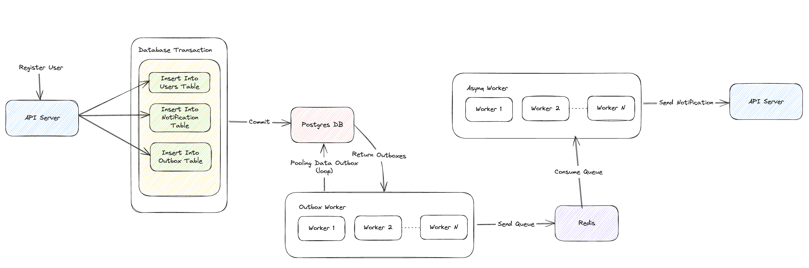

# Golang Atomic Process With Outbox & Asynq
This project showcases the atomic process in microservices, demonstrating how a service can interact with another service asynchronously using the [Asynq](https://github.com/hibiken/asynq) library.

## Problem & Solution
### Problem
In a microservices architecture, ensuring consistency when sending messages between services can be challenging. Directly publishing events within a database transaction can lead to issues where the event is published but the transaction fails, or vice versa.

### Solution
The **Outbox Pattern** ensures atomicity by first storing events in an "outbox" table within the same transaction as the primary operation. A separate process then polls this table and reliably sends the messages to a message queue, ensuring consistency between the database state and external systems.


## Overview
The system consists of three services:
1. **API Server**: Exposes a REST endpoint for user registration. Upon registration, it creates an outbox entry for notifications.
2. **Outbox Worker**: Polls data from the database and sends it to Asynq.
3. **Asynq Worker**: Processes queued notifications asynchronously.

## Overall Architecture

1. The **API Server** handles user registration and inserts an outbox entry into the database.
2. The **Outbox Worker** polls the database for new outbox entries and enqueues them in Asynq.
3. The **Asynq Worker** processes the queued tasks and sends notifications asynchronously.

## Scaling the Outbox Worker
To scale the outbox worker, we use **SELECT FOR UPDATE SKIP LOCKED** in the polling query. This approach allows multiple worker instances to process the outbox table concurrently while ensuring that each row is processed only once.

### Example Query for Scaling
```sql
SELECT * FROM outbox WHERE processed = FALSE ORDER BY created_at LIMIT 10 FOR UPDATE SKIP LOCKED;
```
This ensures that locked rows are skipped by other workers, allowing efficient parallel processing.

### Drawbacks of SELECT FOR UPDATE SKIP LOCKED
- **Starvation**: Older messages can be skipped indefinitely if newer ones keep getting processed.
- **Complexity**: Requires careful handling to ensure fairness and avoid potential inconsistencies.
- **Database Load**: Heavy polling can increase database load, requiring optimizations like batching and rate-limiting.

## Getting Started
### Prerequisites
Ensure you have the following installed:
- [Go](https://go.dev/dl/)
- [PostgreSQL](https://www.postgresql.org/)
- [Redis](https://redis.io/)

### Installation
1. Clone the repository:
   ```sh
   git clone https://github.com/farisdewantoro/golang-atomic-outbox-asynq.git
   cd golang-atomic-outbox-asynq
   ```
2. Install & Generate Swagger Docs:
   ```sh
   make swagger-install
   make swagger
   ```
3. Run Database Migration
    ```sh 
    make db-migrate-up
    ```
3. Run the services:
   - Start the API server:
     ```sh
     go run main.go api-server
     ```
   - Start the Outbox Worker:
     ```sh
     go run main.go outbox-worker
     ```
   - Start the Asynq Worker:
     ```sh
     go run main.go asynq-worker
     ```

## Usage
### Register a User
Send a `POST` request to register a user:
```sh
curl --location 'http://localhost:5001/api/v1/users' \
--header 'Content-Type: application/json' \
--data-raw '{
    "email":"faris-email@gmail.com",
    "password":"this-sample-password"
}'
```
This will create an outbox entry for notification processing.

### Monitoring the Queue
To Open Asynq Monitoring open `http://localhost:8081/monitoring/tasks/` in your browser.


## Technologies Used
- **Go**: Backend programming language
- **PostgreSQL**: Database for storing user and outbox entries
- **Redis**: Message queue system for task processing
- **Asynq**: Distributed task queue for handling background jobs

## Contributing
Contributions are welcome! Feel free to open an issue or submit a pull request.

## License
This project is licensed under the MIT License.

## Author
[Faris Dewantoro](https://github.com/farisdewantoro)

